# VitalPath Education — Digital Health Education Platform

[](https://python.org)
[](https://djangoproject.com)
[](https://stripe.com)
[](https://vitalpath-azure.vercel.app/)
[](https://github.com)

**Live Demo Storefront:** [https://vitalpath-azure.vercel.app/](https://vitalpath-azure.vercel.app/)  
**Creator Studio Login:** [https://vitalpath-azure.vercel.app/dashboard/login/](https://vitalpath-azure.vercel.app/dashboard/login/)  

---

## 📖 Overview

**VitalPath Education** is a production-grade digital educational health platform prototype built for independent creators who need a scalable digital ecosystem to publish educational curricula, monetize digital guides via Stripe, curate YouTube lectures, manage student relationships, and prepare for community scaling into Telegram and Whop memberships.

> **Educational Demonstration Prototype**: VitalPath is designed strictly as an educational publisher and scientific literacy platform. It does not provide clinical diagnoses, treatments, or medical advice.

---

## 🌟 Core Features & Systems

```mermaid
flowchart LR
    subgraph Frontend["Public Storefront"]
        A[Home & Syllabi] --> B[Course Catalog]
        B --> C[Product Detail Page]
        C --> D[Stripe Checkout]
    end

    subgraph Fulfillment["Automated Fulfillment"]
        D --> E[Stripe Webhook Listener]
        E --> F[Order & Payment Ledger]
        E --> G[Customer CRM & LTV]
        E --> H[Email Notification Dispatch]
    end

    subgraph Studio["Creator Studio"]
        F --> I[Revenue Dashboard]
        G --> I
        I --> J[Course Catalog CRUD]
        I --> K[YouTube Video Manager]
    end
```



### 1. Public Storefront & Syllabi
- **Calm, Editorial Visual Identity**: Built with a clean typography scale, subtle borders, restrained shadows, and responsive layout for desktop, tablet, and mobile.
- **Product Catalog (`/courses/`)**: Interactive category filtering, search, pricing, and duration tags.
- **Curriculum Detail Pages (`/courses/<slug>/`)**: Module breakdowns, deliverable checklists (companion PDFs, habit worksheets), target audience criteria, and interactive FAQ accordions.
- **YouTube Content Hub (`/resources/`)**: Curated video lectures with duration tags and category filters.
- **Compliance & Legal Governance**: Transparent terms of service and educational disclaimers distinguishing health literacy from clinical medical practice.

### 2. Monetization & Stripe Checkout
- **Real Stripe Test Mode Checkout**: Live Stripe checkout session creation with hosted card processing.
- **Automated Webhook Fulfillment**: Server-to-server webhook ingestion (`checkout.session.completed`) with HMAC signature verification and idempotency protection.
- **Customer CRM**: Automatic customer record creation, order linking, lifetime value (LTV) calculation, and VIP status classification.

### 3. Creator Management Studio (`/dashboard/`)
- **Commercial Performance Overview**: Gross revenue metrics, order volume, active student counts, and live activity streams.
- **1-Click Product Management**: Create, edit, adjust prices, and toggle products between *Draft* and *Published* status in seconds.
- **Order Ledger**: Searchable, paginated order history with line items, Stripe payment intents, and transaction records.
- **Student CRM**: Profiles, order history, VIP flags, and private creator notes.
- **YouTube Video Manager**: Manage video IDs, duration tags, and homepage features directly from the UI.
- **Membership Leads Tracker**: Review prospective students registered for upcoming Telegram cohorts.

### 4. Decoupled Transactional Email Service
- Abstracted notification service layer (`apps.notifications.services.NotificationService`) delivering branded HTML and plain-text receipts for purchases, waitlist welcomes, and customer inquiries.

---

## 🛠 Tech Stack

| Layer | Technology |
|---|---|
| **Backend Framework** | Python 3.13, Django 5.x, Django ORM, Django Auth |
| **Database** | SQLite (development fallback) / PostgreSQL (production via `dj-database-url`) |
| **Frontend** | Django Templates, Tailwind CSS, Lucide Icons, Vanilla JavaScript |
| **Payments** | Stripe Python SDK (Hosted Checkout & Webhook Handling) |
| **Static Assets** | WhiteNoise with compressed manifest hashing |
| **Deployment** | Vercel Serverless / Gunicorn, Nginx, Systemd, Docker |

---

## 📂 Project Architecture

```
vitalpath/
├── manage.py
├── requirements.txt
├── .env.example
├── vercel.json               # Vercel serverless deployment config
├── Dockerfile
├── docker-compose.yml
├── docs/
│   ├── ARCHITECTURE.md       # Phase 1, Phase 2 (Telegram), Phase 3 (Whop/Memberships)
│   ├── CREATOR_GUIDE.md      # Plain-English guide for the non-technical creator
│   └── DEPLOYMENT.md         # Production Linux VPS, Nginx, Systemd, Gunicorn
├── vitalpath/
│   ├── settings.py           # Configured with WhiteNoise, PostgreSQL, Stripe, Email
│   ├── urls.py               # Main URL dispatcher & custom 404/500 handlers
│   └── wsgi.py               # WSGI entrypoint with serverless auto-init
├── apps/
│   ├── core/                 # Home, about, contact, resources, waitlist leads
│   ├── products/             # Products, modules, resources, FAQs, catalog views
│   ├── orders/               # Customers, orders, payments, webhooks, Stripe service
│   ├── content/              # YouTube videos and educational free tools
│   ├── dashboard/            # Creator management UI (overview, products, orders, CRM)
│   └── notifications/        # Decoupled email/notification service layer
├── templates/                # Responsive Django HTML templates with Tailwind & Lucide
├── static/                   # Custom CSS, JavaScript interactions, and assets
├── tests/                    # Automated test suite (18 unit/integration tests)
├── proposal.md               # Freelance proposal for the client opportunity
└── README.md
```

---

## 🚀 Quickstart & Local Setup

### 1. Clone & Set Up Virtual Environment
```bash
git clone https://github.com/KalminX/vitalpath.git
cd vitalpath
python3 -m venv .venv
source .venv/bin/activate
pip install -r requirements.txt
```

### 2. Configure Environment Variables
```bash
cp .env.example .env
```

### 3. Run Migrations & Seed Demo Data
```bash
python manage.py migrate
python manage.py seed_demo
```

### 4. Start the Development Server
```bash
python manage.py runserver
```
Visit **[http://127.0.0.1:8000](http://127.0.0.1:8000)** in your browser.

---

## 🧪 Automated Testing

Run the comprehensive automated test suite:

```bash
python manage.py test
```

**Results:**
```
Found 18 test(s).
Creating test database for alias 'default'...
..................
----------------------------------------------------------------------
Ran 18 tests in 20.8s

OK (All tests passed)
```

---

## 📚 Documentation Links

- 📐 **[System Architecture & Expansion Roadmap](docs/ARCHITECTURE.md)**: Deep dive into the database models, Stripe webhook state machine, and Telegram community bot integration blueprints.
- 📘 **[Creator & Non-Developer Guide](docs/CREATOR_GUIDE.md)**: Step-by-step plain-English walkthrough for publishing courses, updating videos, and managing students.
- 🚀 **[Production VPS & Cloud Deployment Guide](docs/DEPLOYMENT.md)**: Production deployment instructions for Ubuntu/Debian, Systemd, Nginx, SSL, Vercel, and Docker.
- 💼 **[Client Job Proposal](proposal.md)**: Comprehensive proposal tailored for the freelance client opportunity.

---

## 📄 License & Disclaimer

Copyright &copy; 2026 VitalPath Education. Educational demonstration platform.  
All content and guides are provided for educational purposes only and do not constitute clinical medical advice.
