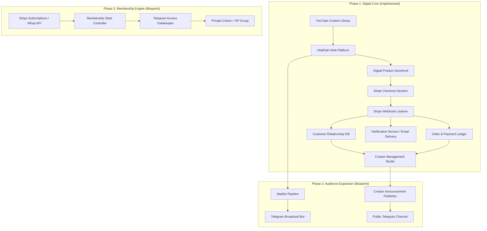
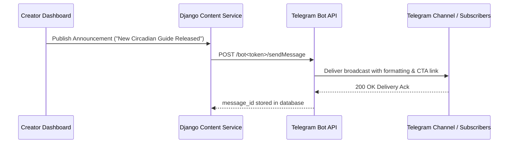
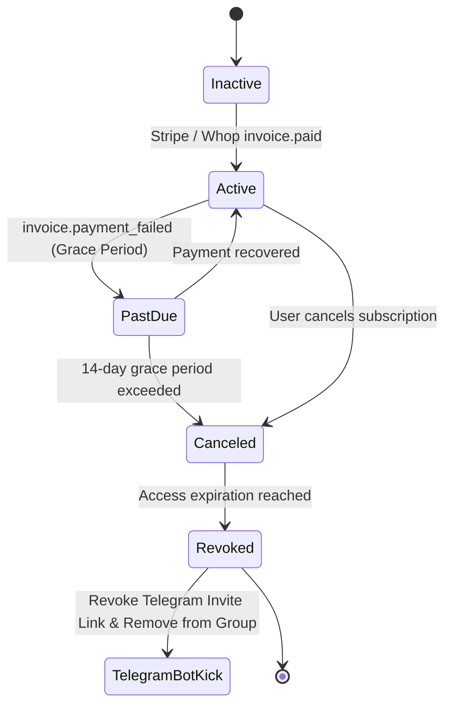

# VitalPath Education — Systems Architecture & Roadmap

This document details the architectural blueprints for **VitalPath Education**, outlining the Phase 1 infrastructure, as well as the planned extension points for Phase 2 (Telegram Broadcasts & Communications) and Phase 3 (Memberships, Whop, and Automated Community Access Control).

---

## 1. System Overview & Phases



---

## 2. Phase 1 Architecture (Implemented & Live)

### A. Web Application & Django Backend
- **Framework**: Django 5.x with modular app structure (`core`, `products`, `orders`, `content`, `dashboard`, `notifications`).
- **Database**: Django ORM with native support for SQLite (development) and PostgreSQL (production via `DATABASE_URL`).
- **Static Assets**: Served via WhiteNoise with compression and cache-busting manifest hashes.
- **Security**: Strict CSRF protection, secure cookie handling, authorization decorators (`@creator_required`), and HMAC signature verification for payment webhooks.

### B. Payment & Fulfillment Pipeline
```
[User on Product Page]
        │
        ▼ (clicks "Purchase for $X")
[POST /checkout/<slug>/]
        │
        ▼
[Stripe Checkout Session API] ──► (Generates hosted secure checkout URL)
        │
        ▼
[Customer completes card payment on Stripe]
        │
        ├──► [Redirect to /checkout/success/?session_id=...] (User facing confirmation)
        │
        └──► [POST /webhooks/stripe/] (Server-to-Server HMAC Signature Verified)
                    │
                    ▼
            [WebhookEvent Record Created] (Idempotency Check)
                    │
                    ├──► [Find / Create Customer Record]
                    ├──► [Create / Update Order (Status: Paid)]
                    ├──► [Create OrderItem line items]
                    ├──► [Record Payment Transaction]
                    ├──► [Update Customer Stats (LTV, order count, VIP status)]
                    └──► [Dispatch send_purchase_confirmation email]
```

### C. Decoupled Notification Service
Transactional communications are abstracted inside `apps.notifications.services.NotificationService`:
```python
send_purchase_confirmation(order)
send_waitlist_confirmation(lead)
send_contact_notification(message)
```
- **Development**: Console/Memory backend (safe, zero external credentials needed).
- **Production**: Seamless switch to Amazon SES, SendGrid, Postmark, or Resend via environment variables.

---

## 3. Phase 2: Telegram Announcements & Broadcasts

### Objective
Provide the creator with a 1-click publishing tool from the Creator Dashboard to send announcements, new YouTube release notes, and daily insights to a Telegram channel.



### Planned Data Model for Phase 2:
```python
class TelegramBroadcast(models.Model):
    title = models.CharField(max_length=200)
    message_text = models.TextField()
    media_url = models.URLField(blank=True)
    telegram_message_id = models.CharField(max_length=100, blank=True)
    status = models.CharField(max_length=20, choices=[('draft', 'Draft'), ('sent', 'Sent'), ('failed', 'Failed')])
    sent_at = models.DateTimeField(null=True, blank=True)
```

---

## 4. Phase 3: Paid Memberships, Whop, and Automated Community Access

### Objective
Offer recurring subscription tiers (e.g., $15/month or $150/year) granting access to:
1. Complete digital product library
2. Private Telegram discussion group
3. Exclusive monthly live Q&A masterclasses

### Architecture & State Management


### Planned Data Models for Phase 3:
```python
class MembershipTier(models.Model):
    name = models.CharField(max_length=100) # e.g. "VitalPath Inner Circle"
    slug = models.SlugField(unique=True)
    price_monthly = models.DecimalField(max_digits=8, decimal_places=2)
    stripe_price_id_monthly = models.CharField(max_length=100)
    features_list = models.TextField()

class Membership(models.Model):
    STATUS_CHOICES = [
        ('active', 'Active'),
        ('past_due', 'Past Due'),
        ('canceled', 'Canceled'),
        ('expired', 'Expired'),
    ]
    customer = models.ForeignKey('orders.Customer', on_delete=models.CASCADE, related_name='memberships')
    tier = models.ForeignKey(MembershipTier, on_delete=models.PROTECT)
    provider = models.CharField(max_length=50, default='stripe') # 'stripe' or 'whop'
    provider_subscription_id = models.CharField(max_length=150, unique=True, db_index=True)
    provider_customer_id = models.CharField(max_length=150, db_index=True)
    status = models.CharField(max_length=20, choices=STATUS_CHOICES, default='active')
    started_at = models.DateTimeField()
    current_period_end = models.DateTimeField()
    cancel_at_period_end = models.BooleanField(default=False)

    # Telegram linkage
    telegram_user_id = models.CharField(max_length=100, blank=True)
    telegram_invite_link = models.CharField(max_length=255, blank=True)
    telegram_access_granted = models.BooleanField(default=False)
```

### Automated Telegram Access Control Flow:
1. **Subscription Activated**: Customer signs up via Stripe/Whop. Webhook triggers `Membership.objects.create(status='active')`.
2. **Bot Generates Single-Use Link**: System calls Telegram API `createChatInviteLink(member_limit=1, expire_date=...)` and emails it to the subscriber.
3. **User Joins**: Telegram Bot receives `chat_member_updated` webhook, correlates the Telegram ID with `Customer.email`, and sets `telegram_access_granted=True`.
4. **Subscription Canceled / Payment Failed**: When `customer.subscription.deleted` arrives, bot calls `banChatMember` followed by `unbanChatMember` to gracefully revoke channel access.

---

## 5. Security & Idempotency Checklist

| Component | Security Control |
|---|---|
| **Stripe Webhooks** | HMAC-SHA256 signature verification via `stripe.Webhook.construct_event`. Raw payload parsed securely. |
| **Idempotent Fulfillment** | Webhook events logged in `WebhookEvent` table by `event_id`. Duplicate deliveries return `200 OK` without duplicate order generation. |
| **Creator Dashboard** | Protected via `@creator_required` enforcing `is_authenticated` and `is_staff`. |
| **Authentication** | Django PBKDF2 with SHA-256 password hashing and session cookies. |
| **Secrets Management** | Zero hardcoded keys; 100% environment-driven via `.env`. |
| **Static File Delivery** | WhiteNoise compressed caching headers. |
